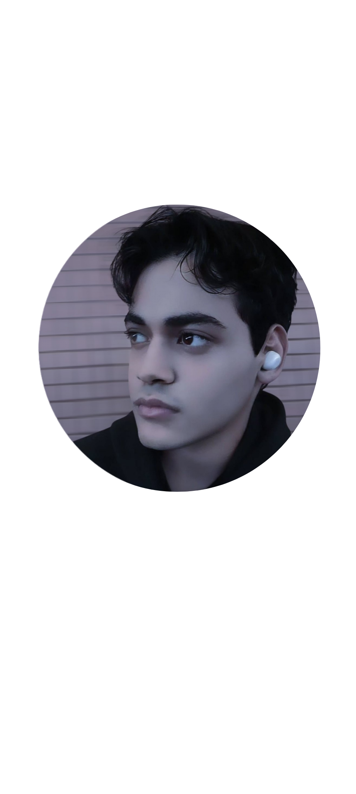

  
  <h1>🎮 Fala Dev! Eu sou o <strong>Luiz Felipe</strong> 👨‍💻</h1>
  

    🔥 Futuro Desenvolvedor Full Stack  
    👾 Apaixonado por tecnologia, games e animes  
    🚀 Em constante evolução no mundo da programação
  

  

---

## 🧠 Sobre Mim

- 💥 Explorando as principais tecnologias do mercado  
- 🚀 Foco atual: **Back-End com Java, Python, NestJS**  
- 🎯 Aprimorando o Front-End com **Angular**  
- 🐍 Também navegando com **Node.js e MySQL**  
- 💡 Filosofia de vida: *"Todo bug é só mais um boss pra derrotar."*  
- 📚 Sempre aprendendo e compartilhando conhecimento

---

## 🛠️ Tecnologias e Ferramentas

  
  
  
  
  
  
  

---

## 📈 GitHub Stats

  
  

---

## 🌐 Onde Me Encontrar

  
  
  

---

## ⚔️ Dev Motto

  <i>"Todo bug é só mais um boss pra derrotar."</i>   
  

---

## 🕹️ Favoritos: Dying Light & Elden Ring

  
  

---

## 🧙‍♂️ Bora Codar e Subir de Level!

  

